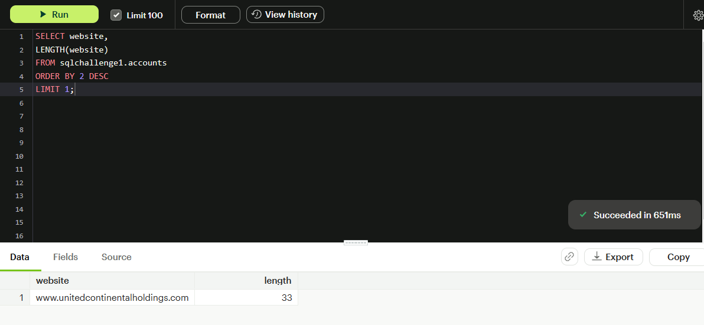
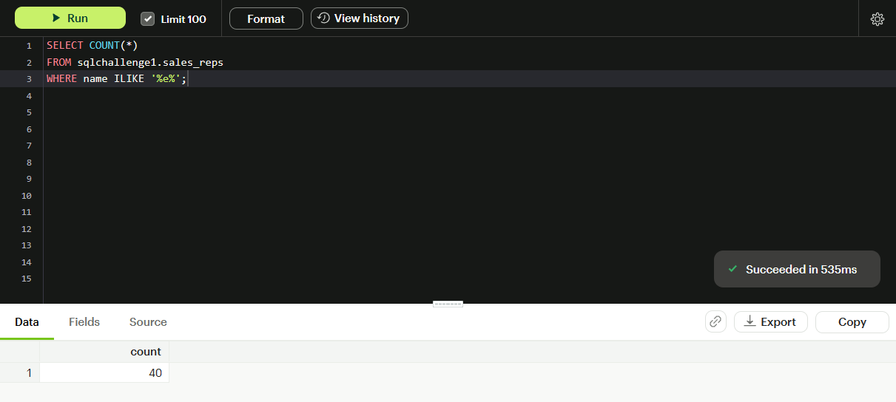
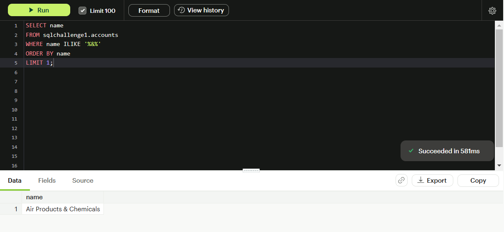
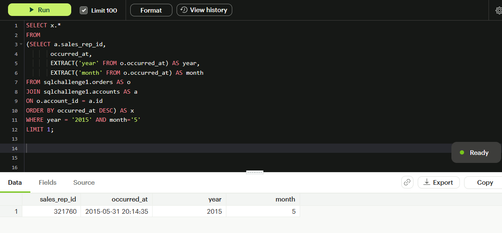
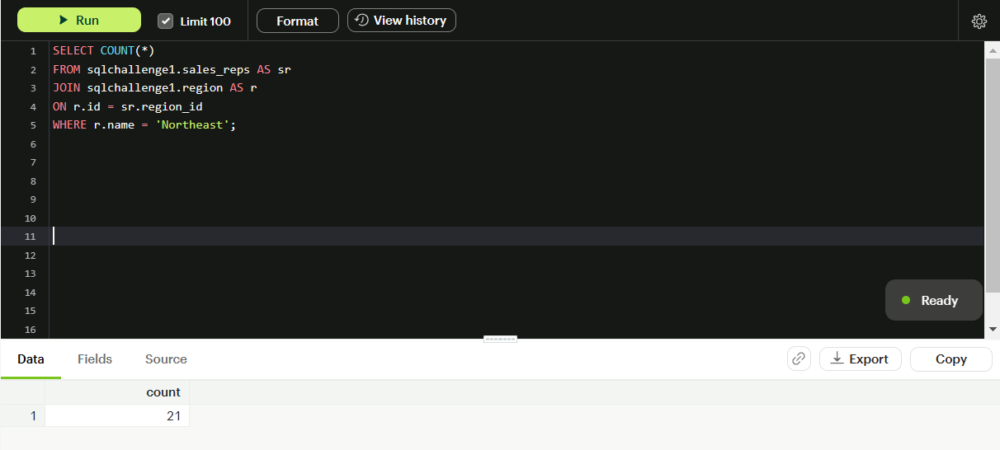

# SQL_Mode_Challenge

## Purpose

This repository contains the solutions of all the SQL challenge questions by Mode. The challenge questions have been divided into three parts - Beginner , Intermediate and Advanced.

## Data Source

The challenge questions and the data have been obtained from MODE.

4 tables were used for solving the questions - 

- sqlchallenge1.accounts
- sqlchallenge1.orders
- sqlchallenge1.region
- sqlchallenge1.sales_reps

## BEGINNER CHALLENGE

**1. List the account name with the longest website URL**

**2. How many sales reps have the letter 'e' in their names?**

**3. What is the alphabetically first account name that contains an ampersand ("&")?**

**4. What is the id of the sales rep that sold the last order in May 2015?**

**5. How many Sales Reps represent the Northeast Region?**

