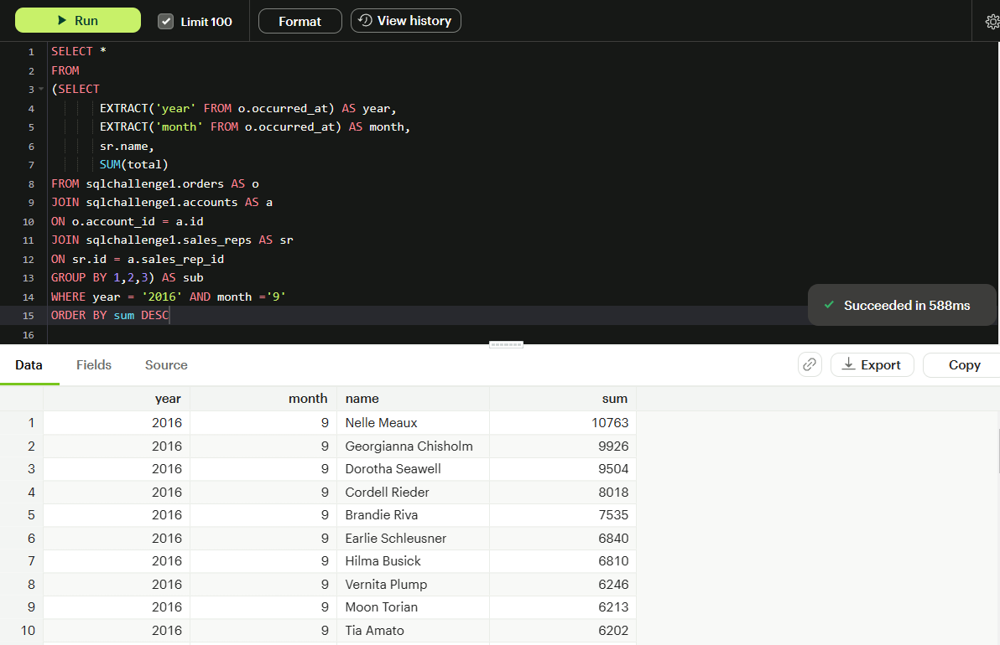

# SQL_Mode_Challenge

## Purpose

This repository contains the solutions of all the SQL challenge questions by Mode. The challenge questions have been divided into three parts - Beginner , Intermediate and Advanced.

## Data Source

The challenge questions and the data have been obtained from MODE.

4 tables were used for solving the questions - 

- sqlchallenge1.accounts
- sqlchallenge1.orders
- sqlchallenge1.region
- sqlchallenge1.sales_reps

## BEGINNER CHALLENGE

**1. List the account name with the longest website URL**

**2. How many sales reps have the letter 'e' in their names?**

**3. What is the alphabetically first account name that contains an ampersand ("&")?**

**4. What is the id of the sales rep that sold the last order in May 2015?**

**5. How many Sales Reps represent the Northeast Region?**

## INTERMEDIATE CHALLENGE

**1. Which region has the lowest proportion of sales reps to accounts?**

Image Not Available

**2. Among sales reps Tia Amato, Delilah Krum and Soraya Fulton, which one had accounts with the greatest total quantity ordered (not USD) in September 2016?**

**3. Of accounts served by sales reps in the northeast, one account has never bought any posters. Which company?

**4. How many accounts have never ordered poster?**

**5. What is the most common first name for Account primary poc's?**

## ADVANCED CHALLENGE

**1. For the West region, which month had the highest percent of poster orders by count during 2015?**

**2. Starting from the time of their first order, which sales rep reached $100,000 in total sales the fastest in terms of time taken.

**3. What is the name of the sales rep who went the longest time between their first and second order?**

**4. How many Sales Reps had atleast 9 orders before surpassing $ 10K cumulative sales?**

**5. What two-calender-day period had the largest dollar amount of purchases?**

## Conclusion

This SQL script has been written by me. Please note that it is entirely possible to solve these queries in other ways.

